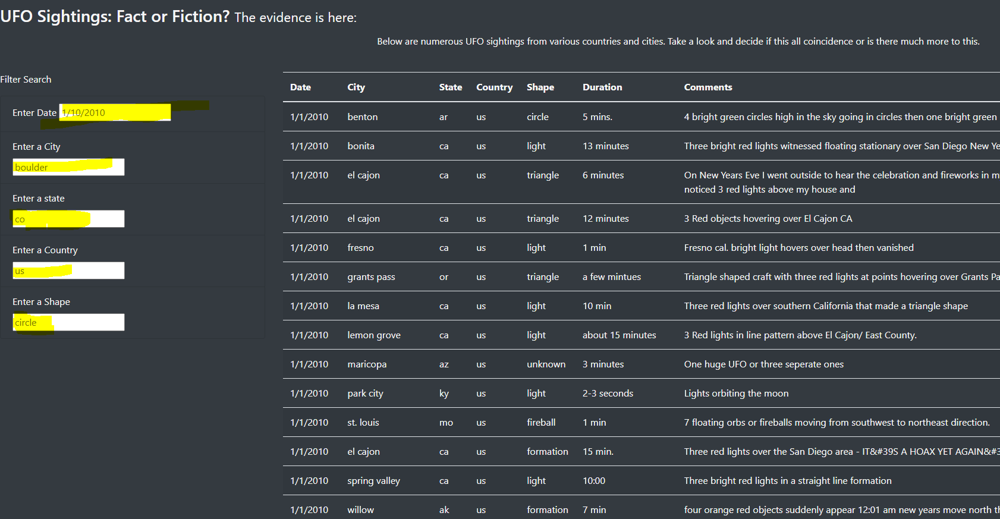

# UFO Sightings
## Background- We were tasked with helpong Dana convert UFO data into a searchable webpage. The data was stored in a .js file. We created a table based on this data for our webpage.
# Navigating the Web Page
## Navigating the page id simple. The lefthand side of the page has multuple filter boxes(seebelow). We have the ability to filter by Date, City, Sate, Country, and shape of the UFO.

# Summary- 
## This webpage is a good starting point but it has limitations: 
1. The data is limited- A future enhamcement could include scarping the web for access to more data.
2. A more robust user interface with additional filter and search options.
